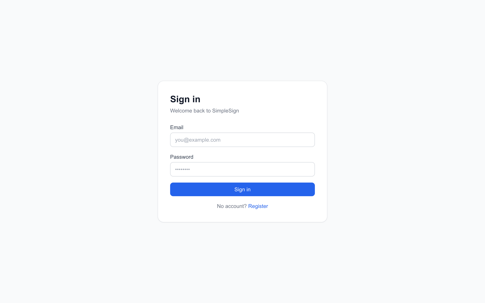
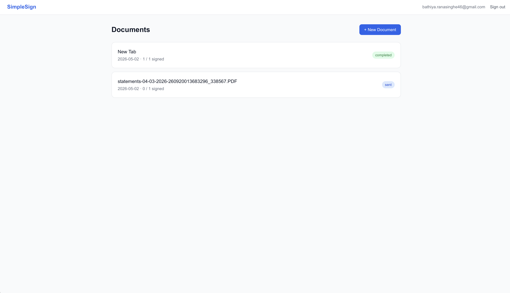
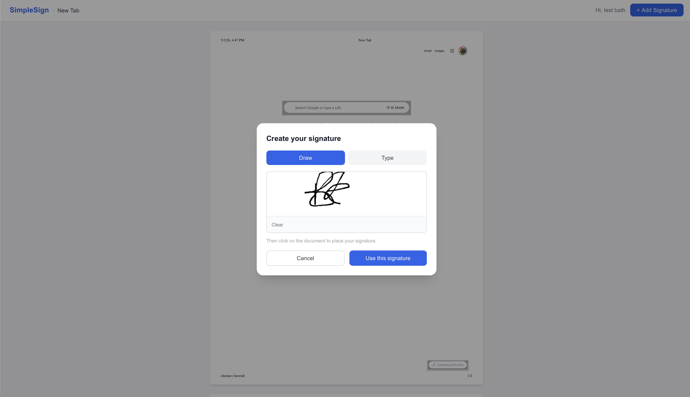

# SimpleSign

A lightweight, self-hosted document signing platform. Upload a PDF, add signers, share unique links — no signer account required. Signatures are drawn or typed in the browser, placed on the document, and merged into a final PDF using pdf-lib.

---

## Screenshots

| Sign in | Dashboard |
|---|---|
|  |  |

**Signing page — draw or type your signature, then click to place it on the document**



---

## Features

### For document owners
- **Register / log in** with email and password (Supabase Auth)
- **Upload PDFs** up to 50 MB via drag-and-drop or file picker
- **Add multiple signers** — name, email, and optional signing order
- **Ordered signing** — enforce a sequence so signer 2 cannot sign until signer 1 completes
- **Share signing links** — each signer gets a unique UUID token URL; no signer account needed
- **Dashboard** — lists all documents with live status badges (Draft → Sent → In Progress → Completed)
- **Document detail page** — per-signer status, signed/opened timestamps, copy link button
- **Download completed PDF** — signed URL to the final merged document
- **Delete documents** — removes database records and both storage files

### For signers
- **No login required** — signers open their unique link directly
- **Draw or type signature** — freehand canvas drawing or styled italic text
- **Place anywhere** — click any page to stamp the signature; drag to reposition before submitting
- **Multi-page support** — scroll through all pages and place signatures on any page
- **Ordered signing guard** — signer sees a "waiting for prior signer" screen if they arrive out of order
- **Already-signed guard** — duplicate submissions are rejected with a clear message

### Completion
- When all signers have submitted, the backend automatically embeds all signatures into the original PDF using pdf-lib and stores the final document in Supabase Storage
- Signature coordinates are stored as page fractions (0.0–1.0), making placement resolution-independent across any screen size

---

## Tech Stack

| Layer | Technology |
|---|---|
| Frontend framework | Next.js 14 (App Router, TypeScript) |
| Backend framework | Express 4 (TypeScript) |
| Auth | Supabase Auth (email/password) |
| Database | Supabase (PostgreSQL) |
| File storage | Supabase Storage |
| PDF rendering (browser) | react-pdf v10 + pdfjs-dist v5 |
| PDF generation (server) | pdf-lib v1.17 |
| Signature canvas | react-signature-canvas |
| Styling | Tailwind CSS v3 |
| Containers | Docker multi-stage builds + Docker Compose |
| Monorepo | npm workspaces |
| Frontend hosting | Vercel |
| Backend hosting | Azure Container Apps |
| Container registry | Azure Container Registry |
| CI/CD | GitHub Actions |

---

## Project Structure

```
simplesign/
├── apps/
│   ├── api/                        # Express + TypeScript backend (port 4000)
│   │   └── src/
│   │       ├── config/env.ts       # Zod-validated environment variables
│   │       ├── lib/supabase.ts     # Anon client (JWT validation) + admin client (DB/storage)
│   │       ├── middleware/
│   │       │   ├── auth.ts         # JWT → supabase.auth.getUser()
│   │       │   └── errorHandler.ts
│   │       ├── routes/             # Express routers
│   │       ├── controllers/        # Request/response handlers
│   │       ├── services/
│   │       │   ├── document.service.ts
│   │       │   ├── signing.service.ts  # Session validation, ordered signing, completion detection
│   │       │   └── pdf.service.ts      # pdf-lib merge + Storage upload
│   │       └── types/index.ts
│   │
│   └── web/                        # Next.js 14 frontend (port 3000)
│       └── src/
│           ├── app/
│           │   ├── (auth)/         # Login + register pages
│           │   ├── dashboard/      # Document list, upload wizard, document detail
│           │   └── sign/[token]/   # Public signing page (no auth)
│           ├── lib/
│           │   ├── api.ts          # Typed fetch wrapper → backend
│           │   ├── auth.ts         # getAccessToken() helper
│           │   └── supabase.ts     # Browser Supabase client (auth only)
│           └── hooks/useAuth.ts
│
├── supabase/schema.sql             # Full database schema — run once in Supabase SQL Editor
├── docker-compose.yml
└── package.json                    # Root npm workspaces + dev scripts
```

---

## API Reference

All authenticated routes require `Authorization: Bearer <supabase-jwt>`.

### Health
| Method | Path | Auth | Description |
|---|---|---|---|
| GET | `/api/health` | None | Liveness probe — returns `{ status: "ok" }` |

### Documents
| Method | Path | Auth | Description |
|---|---|---|---|
| GET | `/api/documents` | JWT | List documents owned by the caller |
| POST | `/api/documents` | JWT | Upload a PDF (`multipart/form-data`, field: `file`) |
| GET | `/api/documents/:id` | JWT | Get document details + signers |
| DELETE | `/api/documents/:id` | JWT | Delete document, signers, and storage files |
| POST | `/api/documents/:id/signers` | JWT | Add signers `{ signers: [{ name, email, sign_order }] }` |
| POST | `/api/documents/:id/send` | JWT | Set status → `sent`, activates signing links |
| GET | `/api/documents/:id/download` | JWT | Returns a 1-hour signed URL for the completed PDF |

### Signing (public — no JWT)
| Method | Path | Auth | Description |
|---|---|---|---|
| GET | `/api/sign/:token` | None | Validate token; returns session, signer info, and a signed PDF URL |
| POST | `/api/sign/:token` | None | Submit signature placements `{ placements: [...] }` |

**Placement object:**
```json
{
  "page_number": 1,
  "x": 0.1,
  "y": 0.75,
  "width": 0.25,
  "height": 0.06,
  "signature_data_url": "data:image/png;base64,..."
}
```
All coordinates are fractions of the page dimensions (0.0–1.0).

---

## Database Schema

### Tables

**`documents`**
| Column | Type | Notes |
|---|---|---|
| `id` | UUID | Primary key |
| `owner_id` | UUID | References `auth.users` |
| `title` | TEXT | Filename shown in dashboard |
| `status` | enum | `draft` → `sent` → `in_progress` → `completed` |
| `storage_path` | TEXT | Path in `documents` storage bucket |
| `final_path` | TEXT | Path in `completed-documents` bucket (set on completion) |
| `page_count` | INTEGER | Page count of the original PDF |

**`signers`**
| Column | Type | Notes |
|---|---|---|
| `id` | UUID | Primary key |
| `document_id` | UUID | References `documents` |
| `name` / `email` | TEXT | Signer identity |
| `sign_order` | INTEGER | 1 = unordered; higher values enforce sequence |
| `status` | enum | `pending` → `opened` → `signed` |
| `token` | UUID | Unique signing link token |
| `signed_at` / `opened_at` | TIMESTAMPTZ | Audit timestamps |

**`signature_placements`**
| Column | Type | Notes |
|---|---|---|
| `signer_id` / `document_id` | UUID | Foreign keys |
| `page_number` | INTEGER | 1-indexed page |
| `x`, `y`, `width`, `height` | NUMERIC | Fractional page coordinates |
| `signature_data_url` | TEXT | Base64 PNG data URI |

### Storage Buckets
| Bucket | Path pattern | Access |
|---|---|---|
| `documents` | `{owner_id}/{doc_id}/original.pdf` | Private — backend generates signed URLs |
| `completed-documents` | `{owner_id}/{doc_id}/final.pdf` | Private — backend generates signed URLs |

---

## Local Development

### Prerequisites
- Node.js 20+
- A [Supabase](https://supabase.com) project

### 1. Run the database schema

In your Supabase dashboard → **SQL Editor**, paste and run the contents of [`supabase/schema.sql`](supabase/schema.sql).

### 2. Configure environment variables

**`apps/api/.env`**
```env
PORT=4000
NODE_ENV=development
SUPABASE_URL=https://<project-ref>.supabase.co
SUPABASE_ANON_KEY=eyJ...
SUPABASE_SERVICE_ROLE_KEY=eyJ...
FRONTEND_URL=http://localhost:3000
```

**`apps/web/.env.local`**
```env
NEXT_PUBLIC_SUPABASE_URL=https://<project-ref>.supabase.co
NEXT_PUBLIC_SUPABASE_ANON_KEY=eyJ...
NEXT_PUBLIC_API_URL=http://localhost:4000
```

### 3. Install dependencies

```bash
npm install
```

### 4. Run both services

```bash
npm run dev
```

- Frontend: http://localhost:3000
- Backend: http://localhost:4000

---

## Docker

### Prerequisites
- Docker Desktop (or Docker Engine + Compose)
- A `.env` file at the repo root with the two `NEXT_PUBLIC_*` variables (used as Docker build args):

```env
NEXT_PUBLIC_SUPABASE_URL=https://<project-ref>.supabase.co
NEXT_PUBLIC_SUPABASE_ANON_KEY=eyJ...
```

### Build and start

```bash
docker compose up --build
```

- Frontend: http://localhost:3000
- API: http://localhost:4000

The API container waits for the health check to pass before the web container starts.

### Architecture notes
- Both containers are built from the **monorepo root** as the Docker context so they share the root `package.json` and `package-lock.json`
- The web image uses Next.js **standalone output** with `outputFileTracingRoot` pointing to the monorepo root, which ensures `next` itself is bundled into the standalone directory
- The PDF.js worker (`pdf.worker.min.mjs`) is copied from `node_modules` into `apps/web/public/` during the Docker build and served as a static file

---

## Production Deployment

### Infrastructure overview

```
┌─────────────────────────────────────────────────────────┐
│  User's browser                                          │
│      │                                                   │
│      ▼                                                   │
│  Vercel (Frontend)          Azure Container Apps (API)  │
│  docu-sign-simple-web  ───► simplesign-api              │
│  .vercel.app                .australiaeast              │
│      │                          │                        │
│      └──── Supabase Auth ───────┘                        │
│                │                                         │
│         Supabase (DB + Storage)                          │
└─────────────────────────────────────────────────────────┘
```

| Service | URL |
|---|---|
| Frontend | https://docu-sign-simple-web.vercel.app |
| Backend API | https://simplesign-api.purplesmoke-273680ee.australiaeast.azurecontainerapps.io |
| Health check | https://simplesign-api.purplesmoke-273680ee.australiaeast.azurecontainerapps.io/api/health |

---

### CI/CD — how deploys work

**Backend (Azure)** — triggered on every push to `main`:
1. GitHub Actions builds the Docker image from the monorepo root
2. Pushes the image to Azure Container Registry (`simplesignacr.azurecr.io`)
3. Updates the Container App with the new image and env vars

**Frontend (Vercel)** — triggered automatically by Vercel's GitHub integration on every push to `main`. No GitHub Actions step required.

Workflow file: [`.github/workflows/deploy.yml`](.github/workflows/deploy.yml)

---

### Setting up from scratch

#### 1. Supabase

1. Create a project at [supabase.com](https://supabase.com)
2. Run [`supabase/schema.sql`](supabase/schema.sql) in the SQL Editor
3. Note your project URL, anon key, and service role key

#### 2. Azure

Install the Azure CLI (`brew install azure-cli`), then:

```bash
# Log in
az login
az extension add --name containerapp --upgrade
az provider register --namespace Microsoft.App
az provider register --namespace Microsoft.ContainerRegistry

# Create resources
az group create --name simplesign-rg --location australiaeast

az acr create \
  --name simplesignacr \
  --resource-group simplesign-rg \
  --sku Basic \
  --admin-enabled true

az containerapp env create \
  --name simplesign-env \
  --resource-group simplesign-rg \
  --location australiaeast

az containerapp create \
  --name simplesign-api \
  --resource-group simplesign-rg \
  --environment simplesign-env \
  --image mcr.microsoft.com/azuredocs/containerapps-helloworld:latest \
  --target-port 4000 \
  --ingress external \
  --min-replicas 1 \
  --max-replicas 3

# Store Supabase credentials as Container App secrets
az containerapp secret set \
  --name simplesign-api \
  --resource-group simplesign-rg \
  --secrets \
    supabase-url="https://<ref>.supabase.co" \
    supabase-anon-key="<anon-key>" \
    supabase-service-role-key="<service-role-key>"
```

#### 3. GitHub Secrets

Go to **repo → Settings → Secrets and variables → Actions** and add:

| Secret | How to get it |
|---|---|
| `AZURE_CREDENTIALS` | `az ad sp create-for-rbac --name simplesign-github --role contributor --scopes /subscriptions/<id>/resourceGroups/simplesign-rg --sdk-auth` |
| `ACR_LOGIN_SERVER` | `az acr show --name simplesignacr --query loginServer -o tsv` |
| `ACR_USERNAME` | `az acr credential show --name simplesignacr --query username -o tsv` |
| `ACR_PASSWORD` | `az acr credential show --name simplesignacr --query passwords[0].value -o tsv` |
| `ACR_NAME` | `simplesignacr` |
| `FRONTEND_URL` | Your Vercel production URL, e.g. `https://your-app.vercel.app` |

#### 4. Vercel

1. Go to [vercel.com](https://vercel.com) → New Project → Import from GitHub
2. In **Project Settings → General → Root Directory**, set to `apps/web`
3. Add these environment variables in the Vercel project settings:

| Variable | Value |
|---|---|
| `NEXT_PUBLIC_SUPABASE_URL` | `https://<ref>.supabase.co` |
| `NEXT_PUBLIC_SUPABASE_ANON_KEY` | your anon key |
| `NEXT_PUBLIC_API_URL` | your Azure Container App FQDN (e.g. `https://simplesign-api.xxx.australiaeast.azurecontainerapps.io`) |

4. Deploy — Vercel auto-deploys on every push to `main` from this point forward

#### 5. First deploy

Push to `main`. GitHub Actions deploys the API to Azure (~3–5 min). Vercel deploys the frontend automatically.

```bash
git push origin main
```

Verify the API is live:
```bash
curl https://simplesign-api.purplesmoke-273680ee.australiaeast.azurecontainerapps.io/api/health
# → {"status":"ok","timestamp":"..."}
```

---

### Environment variables reference

**Backend — set as Container App env vars via GitHub Actions**

| Variable | Description |
|---|---|
| `PORT` | `4000` |
| `NODE_ENV` | `production` |
| `SUPABASE_URL` | Supabase project URL |
| `SUPABASE_ANON_KEY` | Supabase anon key (JWT validation only) |
| `SUPABASE_SERVICE_ROLE_KEY` | Supabase service role key (DB + storage — never exposed to browser) |
| `FRONTEND_URL` | Vercel production URL — used for CORS. Accepts comma-separated values and `*.domain` wildcards |

**Frontend — set in Vercel project settings**

| Variable | Description |
|---|---|
| `NEXT_PUBLIC_SUPABASE_URL` | Supabase project URL |
| `NEXT_PUBLIC_SUPABASE_ANON_KEY` | Supabase anon key (browser-safe) |
| `NEXT_PUBLIC_API_URL` | Full URL of the Azure Container App API |

---

## Security Notes

- The **`SUPABASE_SERVICE_ROLE_KEY`** is only ever present in the API container's environment — it is never sent to the browser
- RLS is enabled on all tables; the backend bypasses it using the service role key and enforces ownership in the service layer
- JWT validation on authenticated routes uses `supabase.auth.getUser(token)` — tokens are verified server-side, not just decoded
- Signing links are single-use UUIDs — already-signed tokens are rejected with HTTP 409
